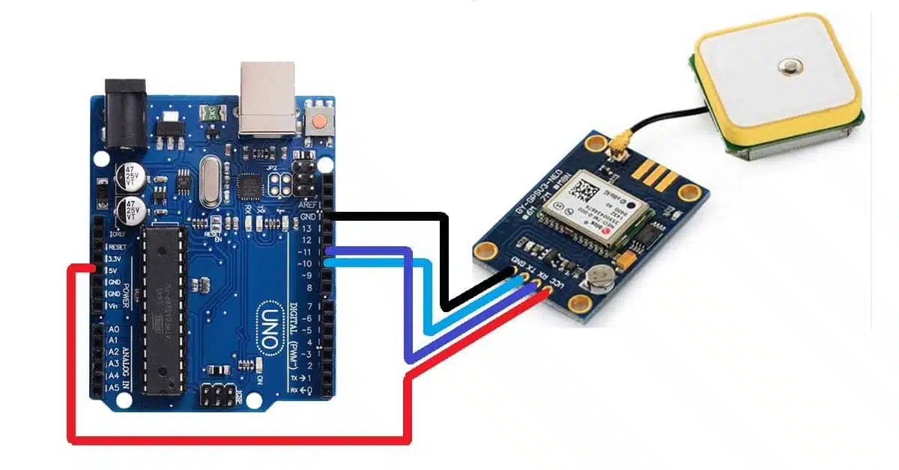

# GPS Module with Arduino Uno R3

This project demonstrates how to interface a NEO-6M GPS Module with an Arduino Uno R3 to retrieve real-time GPS location data such as Latitude, Longitude, Altitude, Speed, Date, and Time using the TinyGPS++ library. The GPS information is displayed on the Serial Monitor.

Hardware Components

- Arduino Uno R3
- NEO-6M GPS Module
- Jumper wires
- Breadboard

How It Works

The GPS module continuously receives satellite signals and sends NMEA data to the Arduino.

The TinyGPS++ library processes the incoming GPS data and extracts useful information.

When a valid GPS signal is detected, the Arduino displays:

- Latitude
- Longitude
- Number of satellites
- Altitude
- Speed
- Date
- Time

If no valid GPS location is available, the Serial Monitor displays:

    Waiting for valid location...

Pin Connections

| Component | Arduino Pin |
|---|---|
| GPS TX | 10 |
| GPS RX | 11 |
| GPS VCC | 5V |
| GPS GND | GND |

Circuit Diagram

Libraries Required

- TinyGPS++
- SoftwareSerial
- 
TinyGPS++ Library GitHub Repository

https://github.com/mikalhart/TinyGPSPlus

YouTube Demonstration

🔗 Watch the project in action on YouTube https://YOUR_YOUTUBE_LINK
